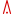
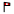
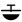
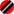

Map Data file formats
=====================

The map data is typically downloaded from the map generator server and
consists of a single ``.xcm`` file. It is a zip file which contains
several separate files for terrain, topography and waypoint data:

-  General map information

-  Terrain (elevation) data, georeferenced in ``terrain.j2w``

-  Waypoint data

-  Topography data file index

-  A set of ESRI format shape file sets with actual topography voctor
   data information, as listed and defined in ``topology.tpl`` (Coasts,
   rivers, roads, cities etc.)

Map information
---------------

``info.txt`` Contains information about the map as a whole, such as
creator, creation time, and lat/lon range.

Terrain data files
------------------

The map cointains a digital elevation model of the map area. It is
stored as an JPEG2000 compressed image in the file ``terrain.jp2``. The
projection information (lat/lon boundaries) of the DEM file are
contained in the text file ``terrain.j2w``, in decimal degree
latitude/longitude format. Water is defined as elevation lower than
``TERRAIN_WATER_THRESHOLD=-30000``, therefore care has to be taken that
JPEG compression parameters and algorithms are used which do not
generate artefacts at the coastlines due to the potentially big jump in
elevation value.

Waypoints
---------

A map database file can contain waypoints. They reside in the
``waypoints.cup`` file, which has regular ``.CUP`` format.

Topography data
---------------

Shape files
~~~~~~~~~~~

Non-elevation topography data is stored in standard ESRI shape files.
For each type of topographic shape (road, river, city outline, etc.)
there is one shape filein ``.shp``, which containes all shapes of this
type. For each ``.shp`` file, there has to be an associated ``.dbf``
file containing shape metadata (such as the name of the city) in dBASE
format, and an index file of ``.shx`` file type which contains the index
that relates the metadata to the shapes.

| All of this is defined in the ESRI shape file standard. The official
  definition of the standard can be found at
| http://www.esri.com/library/whitepapers/pdfs/shapefile.pdf, but there
  are more compact descriptions available on the web, see for example
  wikipedia info and links at
| http://en.wikipedia.org/wiki/Shapefile.

There can be more files associated with each shape file, such as
``.prj``, ``.qix``, ``.atx``, which are not used by XCSoar.

The set of shapefiles actually used by XCSoar and the attributes of each
file are defined in the topography layer description file
``topology.tpl``. All shape files used by the map must be listed there.

Topography layer description file (topology.tpl) format
~~~~~~~~~~~~~~~~~~~~~~~~~~~~~~~~~~~~~~~~~~~~~~~~~~~~~~~

Each line of the topography layer description file (``topology.tpl``)
contains a comma separated list (CSV) of information needed for
rendering of an individual topography layer.  Lines starting with
``*`` are ignored.

XCSoar v6.6 and earlier will display at most 20 topography layers.
XCSoar v6.7 and later will display at most 30 topography layers.

.. container::
   :name: tab:topography-file-format

   .. table:: Topography file format

      ============================ =========== ===========
      Column name                  Data type   Valid range
      filename                     string      
      range                        double (nm)
      icon                         string      
      label index                  int         0-1
      color (red component)        int         0-255
      color (green component)      int         0-255
      color (blue component)       int         0-255
      pen width                    int         0-31
      label range (nm)             double
      important label range (nm)   double
      alpha                        int         0-255
      ============================ =========== ===========

filename
   The filename of the Topography layer within the container file.

icon
   XCSoar v6.5 and earlier, Only the value 219 is recognised, for town
   icons. From XCSoar v6.6, the name of the icon to display. Optional.
   See below for a list of available names.

range
   Zoom level threshold. Layer elements will not be drawn unless zoomed
   in closer than this threshold.

pen width
   Lines contained within this layer are drawn with pen width.

label range
   Label display zoom level threshold. Labels contained in the layer
   file will not be rendered unless zoomed in closer than this
   threshold.

important label range
   A zoom level threshold. Labels contained in the layer file will be
   rendered in standard style when the display zoom level is greater
   than this threshold.

alpha
   The alpha component controls transparency of polygons... 0 means
   polygons are completely transparent, 255 means they are completely
   opaque. Only used by XCSoar v6.7 and later.

   Versions of XCSoar running on Windows and WinCE ignore any item
   where transparency is specified.

Point Features
~~~~~~~~~~~~~~

Prior to XCSoar v6.6, this could contain the value 219 to display an
icon for a town From XCSoar v6.6, a user can put an optional string into
the icon column in topology.tpl in the .XCM file (e.g.)

::

 SpotHeight,5,mountain_top,1,64,64,64,1,5,
 Mast,10,obstacle,,,,,1,10,

This can be used for Shapefiles containing point features or polygons or
linestrings, but is probably only useful for point features.

The icon of the corresponding image and optional label will be
displayed. In the first example, the “mountain_top” icon and a label
will be displayed for each point in the SpotHeight shapefile. My
SpotHeight Shapefile has been generated with the point elevation in feet
as the label value). For the second example, only “obstacle” icons (no
labels) will be displayed for points in the Mast Shapefile..

Icon names are detected in :file:`TopographyStore.cpp`.  Names must be
given in lowercase. If the icon name given is unknown, or no icon name
is given, then icons are not displayed for that Shapefile.

Names correspond to images which have been linked into XCSoar, although
it is envisaged that in future these will be names of icon files.
Available icon names are:

- mountain_top |mountain_top|
- bridge |bridge|
- tunnel |tunnel|
- tower |tower|
- power_plant |power_plant|
- obstacle |obstacle|
- mountain_pass |mountain_pass|
- weather_station |weather_station|
- thermal_hotspot
- town
- mark |mark|
- turnpoint |turnpoint|
- small
- cruise |cruise|
- terrainwarning
- logger
- loggeroff
- target
- teammate_pos
- airspacei
- traffic_safe
- traffic_warning
- traffic_alarm
- taskturnpoint
- marginal |marginal|
- landable |landable|
- reachable |reachable|
- airport_reachable |airport_reachable|
- airport_unreachable |airport_unreachable|
- airport_marginal |airport_marginal|
- airport_unreachable2 |airport_unreachable2|
- airport_marginal2 |airport_marginal2|
- outfield_unreachable2 |outfield_unreachable2|
- outfield_marginal2 |outfield_marginal2|
- outfield_reachable |outfield_reachable|
- outfield_unreachable |outfield_unreachable|
- outfield_marginal |outfield_marginal|

Adding new Icons
~~~~~~~~~~~~~~~~

At the moment, adding new icons requires a rebuild of the XCSoar
application.It is envisaged that, in future, this process won’t be
required… users will include icon files in their ``.xcm`` map container
files, and refer to them by name. However, that has not yet been
implemented.

To add your own images to the list of icons:

#. Create a .svg file for the icon (e.g. :file:`mast.svg`) and copy
   into ``xcsoar/Data/icons``. For Android, the name must be
   lowercase.

#. Insert two (for normal and high-res) lines into
   :file:`xcsoar/Data/XCSoar.rc`, (e.g.)

   ::

      BITMAP_ICON(IDB_MAST, "mast")
      BITMAP_ICON(IDB_MAST_HD, "mast_160")

#. Insert two lines into :file:`xcsoar/src/Resources.hpp` (e.g.)

   ::

      MAKE_RESOURCE(IDB_MAST, 500);
      MAKE_RESOURCE(IDB_MAST_HD, 5500);

#. Add a corresponding line into the ``icon_list`` table in
   :file:`xcsoar/src/Topography/TopographyStore.cpp`

   ::

        {"mast", IDB_MAST},

#. Make XCSoar

After this, a line can be added in :file:`topology.tpl` to connect the
icon to the Shapefile using the icon name. (e.g.)

::

   Mast,10,mast,,,,,1,10,

Note that unless these changes are merged into the main XCSoar
repository, then only your specific build of XCSoar will be able to
display your icon image.

